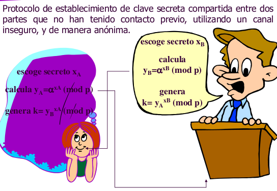
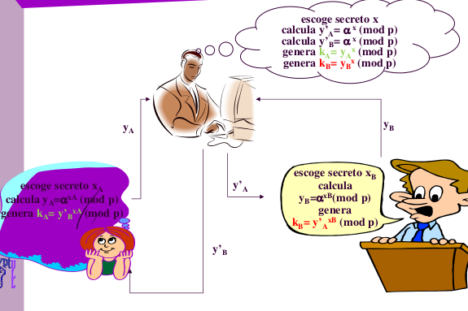

# Práctica para la asignatura de [_Seguridad en sistemas informáticos_](https://campusvirtual.ull.es/1516/course/view.php?id=143) en la que se pide:
---
## Objetivo: Implementar el método de Diffie-Hellman.

Desarrollo:
Implementa el método de Diffie-Hellman en el lenguaje de programación que se desee:

---

---

### En la práctica se pidió realizar la siguiente modificación:
La modificación consiste en implementar el ataque "Man in the middle" para el método Diffie-Hellman:

---

---

#### Para ejecutar: _"ruby main.rb"_ o _"ruby main-mod.rb"_
Al ejecutar _"main-mod.rb"_ se ejecutará el programa con la modificación incluida.

### Enlaces:

+ [Página personal.](http://alu0100768893.github.io/)
+ [Repositorio de la práctica.](https://github.com/alu0100768893/Diffie-Hellman)
+ [Enlace a la asignatura.](https://campusvirtual.ull.es/1516/course/view.php?id=143)
